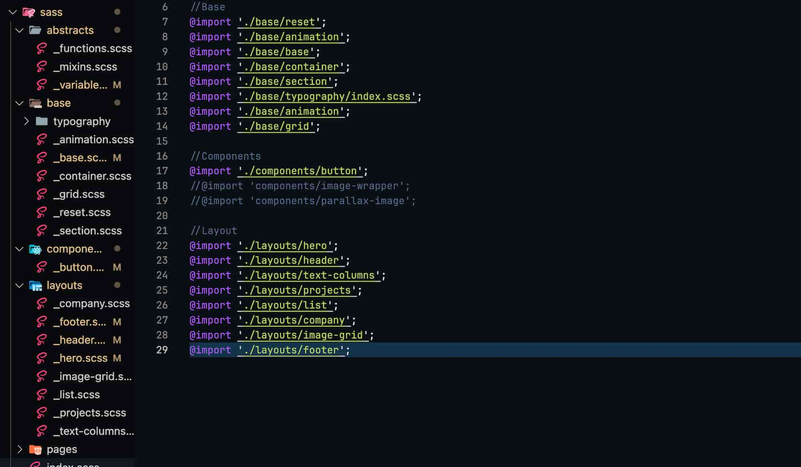
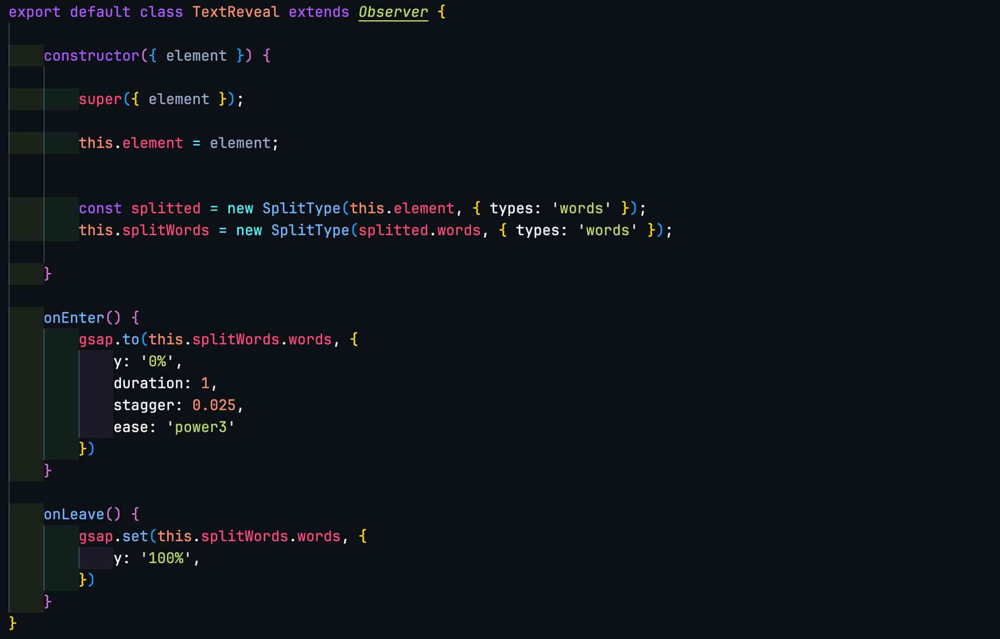

# No Name Studio

## Description

No Name Studio is a modern digital website that showcases the services and projects of a digital agency based in Málaga. The site is designed with HTML and SASS, and uses JavaScript for animations and dynamic interactions.

## Project Structure

The project is structured as follows:

### HTML

The HTML defines the basic structure of the website, including sections such as the hero, about us, projects, product list, and more. Each section is decorated with classes used to apply styles and animations.

### SASS

The styles are organized into several SASS files to keep the code clean and modular.

- `abstracts`: Contains SASS functions, mixins, and variables.
- `base`: Defines base styles, including typography, animations, containers, grids, and resets.
- `components`: Includes specific styles for components like buttons.
- `layouts`: Contains styles for the layout of different sections of the website, such as the header, hero, image grids, etc.

### JavaScript

The JavaScript is organized into several classes to handle animations and user interactions.

- `index.js`: Main entry point that initializes animations and the page.
- `Home.js`: Class that extends `Pages` and handles animations on the home page.
- `Observer.js`: Base class for creating intersection observers.
- `Pages.js`: Manages the creation of various animations such as TextReveal, Button, ParallaxImage, and List.
- `Button.js`, `List.js`, `ParallaxImage.js`, `TextReveal.js`: Classes that define specific animations for buttons, lists, parallax images, and text reveal respectively.
- `smoothScroll.js`: Implements smooth scrolling using GSAP and ScrollTrigger.

## Class and Function Descriptions

- **SmoothScroll**: Implements smooth scrolling using GSAP and ScrollTrigger. Synchronizes user scrolling with GSAP animations to provide a fluid scrolling experience.
- **Observer**: Base class that uses IntersectionObserver to detect when an element enters or leaves the viewport. Extended in other classes to handle specific animations upon entering or leaving the viewport.

- **Pages**: Class that initializes various animations on the page, such as TextReveal, Button, ParallaxImage, and List. Each animation is applied to corresponding elements using data selectors (`data-animation`).
- **TextReveal**: Animates text reveal using GSAP and SplitType to split the text into words and apply entry and exit animations.

- **Button**: Animates buttons upon entering the viewport, expanding the text and showing an icon.
- **ParallaxImage**: Implements a parallax effect on images using GSAP and ScrollTrigger. The image shifts as the user scrolls, creating a sense of depth.
- **List**: Adds an `in-view` class to list elements when they enter the viewport to apply custom styles.
